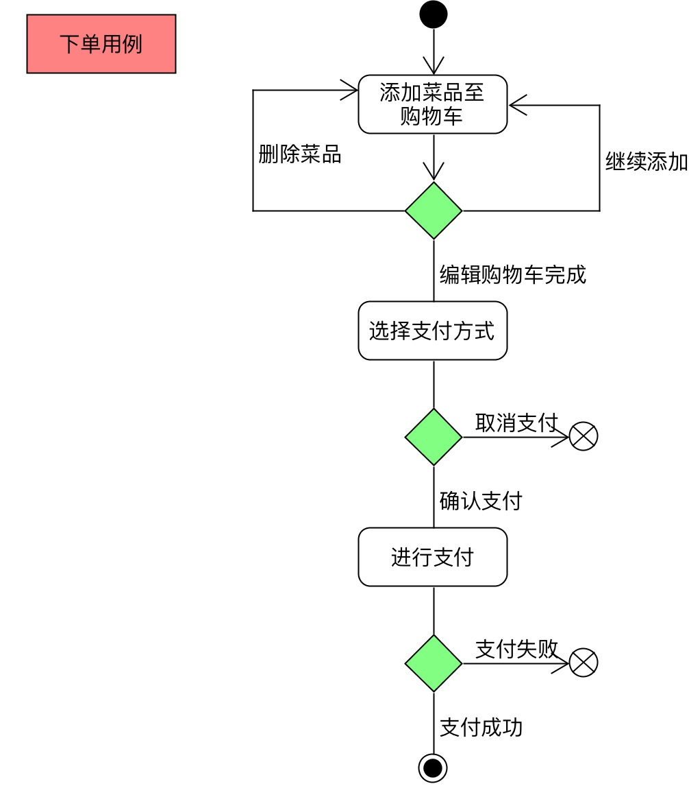
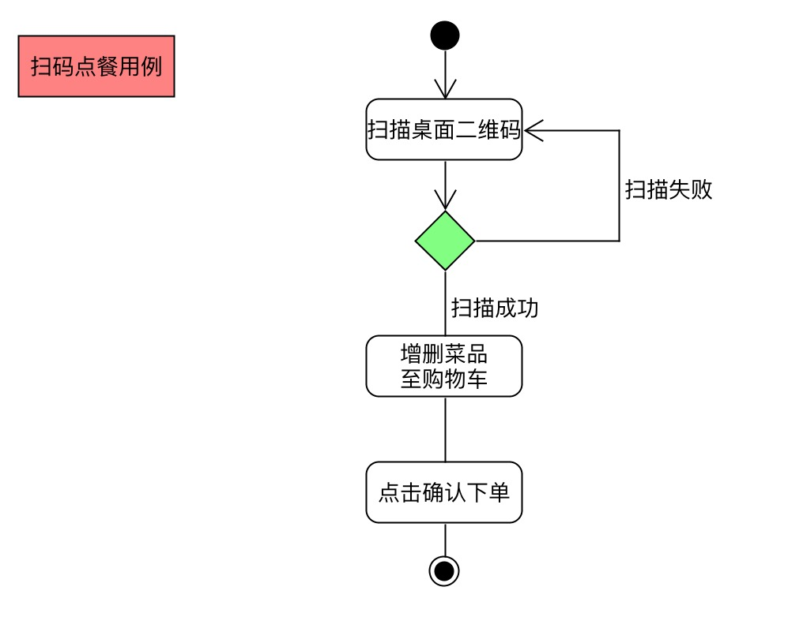

# Detailed Use Case

Use case : Place an order

Scope : Self-help order system

Level : User goal

Primary Actor : Customer

## Stakeholders and Interest:
Customer : 
They want to know a great variety of food and the detailed information for each of them so that they can place an order according to their preference.

Business: 
They offer different kinds of food and want them sell well. Additionally, they want to know the preference of their customers from the analyses of the sales and thus offer more and earn more.

## Preconditions : 
Business man should have registered the system and offer their menu of the food they can provide.

## Success Guarantee :
Business has the material of a dish in stock and the chef is on duty.
Customer will pay for his order.

## Main Success Scenario:
1. Customers choose a table available in the restaurant.

2. Customers scan the QR code on each table.

3. Business men update their menu in time according to their stock.

4. Customers scan the menu to choose the dish they preferred.

5. Customers specify their personal taste for each dish.

6. Customers put them in the shopping cart.

7. Chefs finish those dishes in the list of orders.

8. Business men serve the dish to customers.

9. Customers enjoy their meal and pay for  it before they leave.

10. Money is transferred to the business's account and an E-ticket will be sent to the customer's cellphone.

## Extensions:
2a. There are available chairs in a table but some of them have been already occupied. If someone who scan the QR code on such a table will be rejected to enter the session for this table.

2b. Customers whose cellphones have no access to the Internet will fail to enter the session for a table even if they scan the QR code.

3a. At peak time, business men may fail to check their stock in time to update the menu and thus will offer some choices they can not finish.

4a. Customers may order some wrong dishes because of their careless behavior on their cellphone.

5a. Customers fail to understand the descriptions of different taste and thus the detailed information they provide is not their true preference.

## Special Requirements:
Most Customers have the knowledge of mobile payment.

Customers have access to the Internet to finish mobile payment.

## Technology and Data Variations List:
9a. Customers' payment needs their authentication like a password or fingerprint.

9b. The price of the whole order is correctly accounted by the system and discounts / sales are considered.

9c. Customers' signatures are needed when they choose to pay via credit cards.

 
# Brief Use Case

**Use case: Scan QR Code**

Actors: Customers

Type: Primary

Description: A customer scans the QR code and visit the menu in corresponding table session.

**Use case: Check Cart**

Actors: Customers

Type: Primary

Description: A customer check his cart and edit dishes.

# Casual Case

**Use Case: Shake**

Main Successful Scene:

'Shake' gives a suite of dished for a customer, and he place an order if he is statisfied.

Alternative Scene:

The customer doesn't like some of the recommended dishes, he delete some, and add the rest into the cart.

The customer doesn't like all the recommended dishes, he chooses to shake again.

The customer doesn't like all the recommended dishes, he quit and order dishes by himself.

 

**Use Case: Edit Dish**

Main Successful Scene:

The restaurant owner wants to update the information of some dish and succeed to do so.

Alternative Scene:

The restaurant owner wants to update the information of some dish and failed to do so, then he complains in the app via report.

**Use Case: Check Order**

Main Successful Scene:

The customer wants to check his order again and the app shows his order.

Alternative Scene:

The customer wants to check his order again, while the server returns wrong data, then he complains in the app via report.

