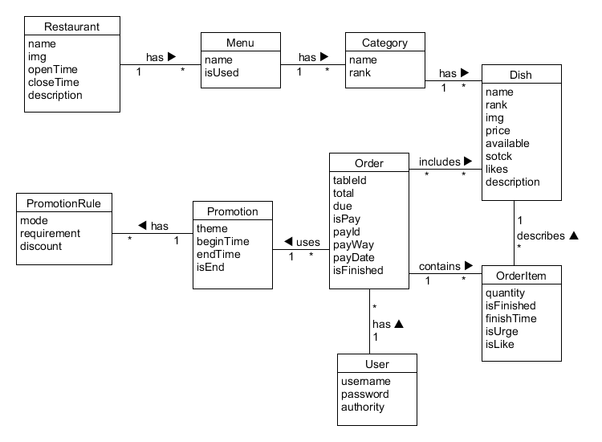

# 模型设计

根据需求，应用中需要用到的模型有`Restaurant`, `Menu`, `Category`, `Dish`, `Order`, `OrderItem`, `Promotion`, `PromotionRule`, `User`.
他们的属性和关系如下图所示：

## Restaurant

* `name`: 餐馆的名字
* `img`: 描述餐馆的图片
* `openTime`: 餐馆营业时间
* `closeTime`: 餐馆结束营业时间
* `description`: 描述餐馆的信息

在该应用中只有一个餐馆实例，因此我们使用了单例模式。餐馆可以用有多个菜单。

## Menu

* `name`: 菜单的名字
* `isUsed`: 该菜单是否正在被使用

一个餐馆可以拥有多个菜单，但每个菜单都属于同一个餐馆。特别地，`isUsed`标识了当前使用的菜单，因此只能有一个菜单的`isUsed`字段值为`True`.菜单不直接包含菜品，而是拥有着多个类别，而类别中才包含着菜品。

## Category

* `name`: 类别的名字
* `rank`: 类别的顺序

一个菜单可以拥有多个类别，但是一个类别只对应于一个菜单。类别中的`rank`字段仅用于前端显示时的显示顺序。一个类别可以拥有属于该类别的多个菜品。

## Dish

* `name`: 菜品的名字
* `rank`: 菜品的顺序
* `img`: 菜品的图片
* `price`: 菜品的单价
* `available`: 菜品是否上架
* `stock`: 菜品的库存
* `likes`： 菜品的点赞数
* `description`: 菜品的文字描述

菜品的`rank`字段仅用于前端显示时的显示顺序。一个菜品只存在于一个类别之中，但一个类别可以拥有多个不同的菜品。

## Order

* `tableId`: 下订单的桌号
* `total`: 订单的原总价
* `due`: 订单的折后应付价
* `isPay`: 订单是否被支付
* `payId`: 支付Id
* `payWay`: 支付方式
* `payDate`: 支付时间
* `isFinished`: 订单中的菜是否已全部上齐

`payId`只是用于标识订单的字段，实际情况下可能并非是一个id的形式，该字段主要用于使用第三方接口时找到实际支付的信息，用此信息与订单信息核对（主要是支付金额与`due`字段的值核对）。注意，一个订单可以包含多个菜品，而一个菜品也可以存在于多个订单中。因此，需要一个特殊的模型来描述一个订单中的每个菜的信息，在这里，我们使用了`OrderItem`模型。

## OrderItem

* `quantity`: 单个菜品的数量
* `isFinshed`: 是否上菜
* `finishTime`: 上菜的时间
* `isUrge`: 该菜品是否被催单
* `isLike`: 该菜品是否已被点赞

注意，一个订单可以拥有多个`OrderItem`，但每个`OrderItem`只对应于一个菜品，而每个菜品可以拥有多个`OrderItem`，因为每个菜品都可以在多个订单中。`OrderItem`中所有的字段信息都用来描述某一订单下的某一菜品。

## Promotion

* `theme`: 优惠活动的主题
* `beginTime`: 活动开始时间
* `endTime`: 活动结束时间
* `isEnd`: 活动是否已经结束

每个活动都可以有多个优惠的规则`PromotionRule`。

## PromotionRule

* `ode`: 优惠规则的模式，分为满减和满折两种
* `requirement`: 满减或满折所要满足的前提总金额
* `discount`: 具体折扣，如果是满减，则值为满减金额，如果是满折，则值为满折的折扣

## User

* `username`: 用户名，用于登录
* `password`: 密码，用于登录
* `authority`: 权限，分为三种：`manager`, `cook`, `customer`

# API设计

为了沟通前端与后端，需要提供必需的API。

## 用户API

* `POST cusers/session`
用于顾客登录，我们希望使用微信登录，这样只需提供一个微信登录接口返回的id即可，实际中，我们使用一个自己输入的id代替这个微信返回的id。
请求体：一个`username`模拟wechatid
响应：成功返回200状态码和成功信息，失败则返回对应失败状态码和失败信息。

* `POST busers/session`
用于商家登录，需要提供用户名和密码。密码在前端加密后传输到后端，在后端加密后保存在数据库。
请求体：`username`和`password`
响应：成功返回200状态码和成功信息，失败则返回对应失败状态码和失败信息。

* `PUT busers/password`
用于修改密码。
请求体：旧的`password`和新的`password`
响应：成功返回200状态码和成功信息，失败则返回对应失败状态码和失败信息。

## 菜单、类别、菜品API

* `POST menus/`
新建菜单，只需要提供name和used字段即可。菜单中的类别通过新建类别来建立联系。在新建菜单中，无需关心类别和菜品。
请求体：`name`和`used`
响应：成功返回200状态码和新建菜单的id，失败则返回对应失败状态码和失败信息。

* `POST menus/<menuid>/categories/`
在某一菜单下新建类别，只需要提供name和rank字段即可。类别中的菜品通过新建菜品来建立联系。在新建类别中，无需关心菜品。
请求体：`name`和`rank`
响应：成功返回200状态码和新建类别的id，失败则返回对应失败状态码和失败信息。

* `POST menus/<menuid>/categories/<catid>/dishes/`
在某一菜单下的某一类别下新建菜品。likes点赞字段不用提供，这个字段只能由用户修改（用户点赞）。
请求体：`name`，`rank`，`img`，`price`，`stock`，`available`
响应：成功返回200状态码和新建菜品的id，失败则返回对应失败状态码和失败信息。

* `PUT menus/<menuid>`
* `PUT menus/<menuid>/categories/<catid>`
* `PUT menus/<menuid>/categories/<catid>/dishes/<dishid>`
修改菜单、类别和菜品，提供的信息和`POST`时一样。

* `DELETE menus/<menuid>`
* `DELETE menus/<menuid>/categories/<catid>`
* `DELETE menus/<menuid>/categories/<catid>/dishes/<dishid>`
删除时，并没有真正删除一个菜单、类别、菜品，因为菜品与订单有关，而订单是不能随便删除的，因此与之对应的菜品和与菜品有关的菜单和类别也不能随便删除。我们使用了假删除，只是修改其中的一个字段，用于标记是否删除。

* `GET`
GET类型的API分为获取所有和获取单个，比如获取所有菜单是`GET menus/`，获取单个菜单则是`GET menus/<menuid>`。`GET`方法返回获取的对象的实例，用`json`格式表示。

## 订单API

* `POST orders/cuser/`
用户新建订单，请求体中的原价和折后价，后端需要重新计算并与之核对，若出现错误则要返回错误信息通知前端价格有错。这样做的原因是防止前端传来的请求被恶意修改。`content`对应一个数组，里面的元素是`json`，每个`json`包含了一个菜的`id`和菜的数量。
请求体：`tableId`，`price`，`due`，`content`
响应：成功返回200状态码和新建订单的id，失败则返回对应失败状态码和失败信息。

* `POST orders/cuser/oid/<orderId>`
订单付款。理想情况下，我们会根据payId，使用第三方接口，查询到支付的真实信息，然后与订单的价格核对。实际情况下，我们没有申请到微信支付等第三方支付方式的接口。
请求体：`payId`，`payWay`
响应：成功返回200状态码和成功信息，失败则返回对应失败状态码和失败信息。

* `PUT orders/cuser/oid/<orderId>`
用户修改订单。用户可以对他们下单的菜品进行催单和点赞，需要提供一个菜品id，是否催单的字段和是否点赞的字段。该API首先会判断该菜品id是否在这个订单中，然后判断是否已经催单或已经点赞。如果是第一次点赞，则对应的`dish`实例中的`likes`也要响应加1.
请求体：`orderItemId`，`like`，`urge`
响应：成功返回200状态码和成功信息，失败则返回对应失败状态码和失败信息。

* `PUT orders/buser/oid/<orderId>`
商家修改订单。商家完成订单中的一个菜品时，传入`time`和`finished`字段表示菜品完成以及完成时间。注意当订单中，所有的菜品都已经完成，那么订单的`finished`字段会自动设置为`True`。
请求体：`orderItemId`，`time`，`finished`
响应：成功返回200状态码和成功信息，失败则返回对应失败状态码和失败信息。

* `GET`
`GET`请求可以返回单个或全部订单，分为商家可以看到的订单或用户可以看到的订单。比如商家获取全部订单`GET orders/buser/`, 用户获取单个订单`GET orders/cuser/oid/<orderId>`